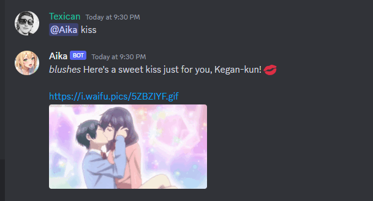

# Aika


Aika is a ChatGPT powered anime waifu for Discord. She is a companion, an assistant, and a utility.



> [Aika Talking](https://aika.lystic.zip/user-content/sample_clip.mp3)

## Features

Aika is more than just a fun chat bot. She has functional integrations with many services and can chain these together to assist users in nearly any task. 

Here is an exhaustive list of what she can do:
- Text-based interaction via [ChatGPT](#)
- Image generation via [Dall-E](#)
- Basic web searching via [DuckDuckGo](#)
- Acquire human-created waifu images via [Waifu.pics](#)
- Random number generation
- Anime lookup via [MyAnimeList](#)
- Tag individual members in her messages (@ing)
- Search [YouTube](#) for videos
- Download [YouTube](#) videos to MP4
- **Join voice chat and speak**
- Play music in voice chat via [YouTube](#)

Aika can chain any of these actions together as commanded and at will. For example:
> "Aika join voice and play Never Gonna Give You Up."

You can always ask Aika what functions she can use:
> "Aika what functions can you use?"

## Voice Chat

You can chat with Aika in voice. 
Join a channel Aika has permissions to and ask her to join you. 
Once Aika joins, wait a second or two before talking to her.

After speaking your message, your microphone must be silent for **1 second** for Aika to pick it up. 
I recommend using Krisp to silence any background noise.

Aika requires the keyword `Aika` be spoken in order to respond.
After Aika responds, the speaker can continue the conversation without requiring the keyword *if* they start speaking within **2 seconds**.

> Example: "Hey **Aika**, How Are you?"

## Self Hosting

Running your own Aika-themed bot can be easy. 

1. Updated the [system messages](./discord/discordai/) with your own persona-themed ones.
2. [Build](#build)
3. [Run](#run)

### Dependencies / APIs

Aika requires a few depenedencies to operate.

1. An [S3](#) compatible object store
2. A [Discord Bot](#) API key
3. An [OpenAI](#) API key
4. An [ElevenLabs](#) API key

### Build

Aika is containerized via [Docker](#). No special build requirements are needed, simply use `docker build`

```shell
$ docker build -t mycustom/dockertag
```

### Run

```shell
$ ./run.sh beta
```

*see [run.sh](./run.sh) for environment variables required.*

## TODO

Voice Chat & Audio Mixer Refactor (hacked in right now)

GPT Vision support

Add more guild & operator admin commands
- let aika control guild as admin bot for guild owners?
- let operator enable and disable "premium" guilds via chat
- let operator overwrite system message at runtime
- let operator force aika out of discords

Improve rate limiting

Further imrpovements to voice chat for natural interaction

Token counting rather than history limit

Drop history after X hours of inactivity / cost efficiency?

Report/Track token usage by guild/user

"Reminder / Alert" function so Aika can DM users @ specific times for specific things

"Let aika pull photos of 'herself' from S3

Improve youtube download for cost efficiency

Reduce voice interaction latency further by streaming to Whisper ?

Investigate alternative transcription APIs

Investigate alternative TTS APIs (Like OAI and PlayHT)